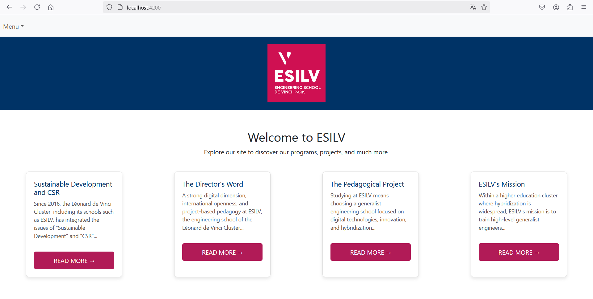
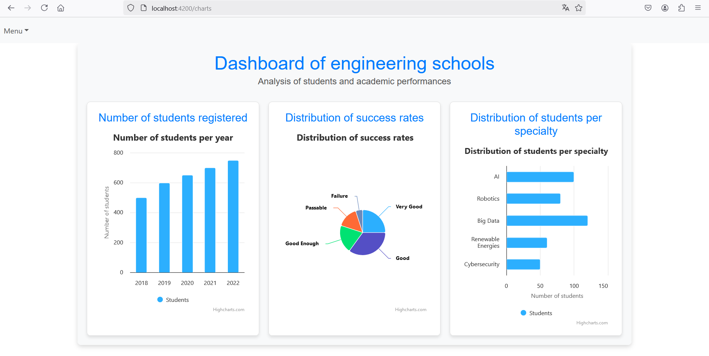
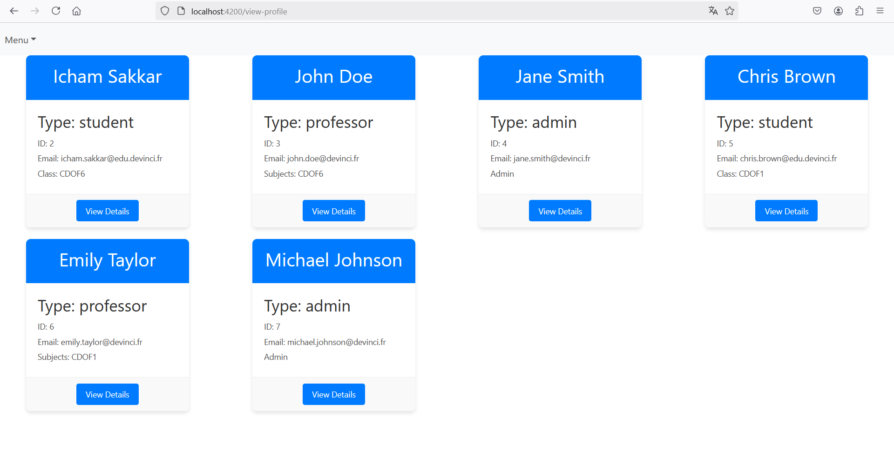
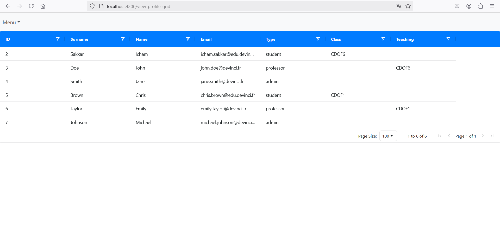
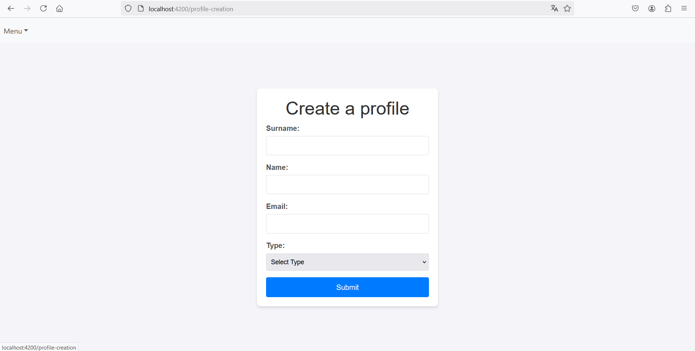
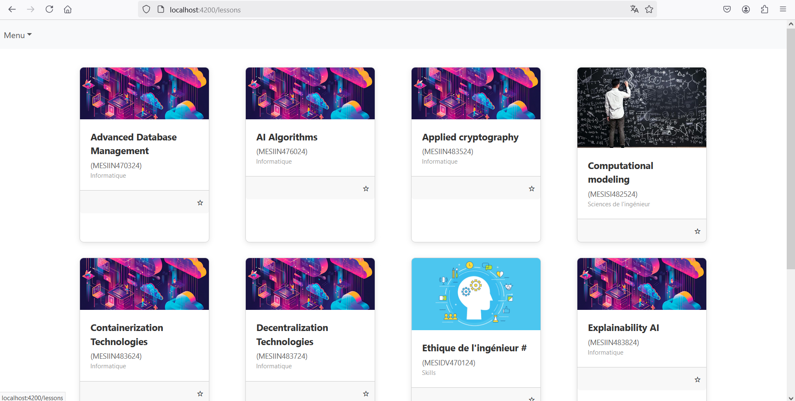
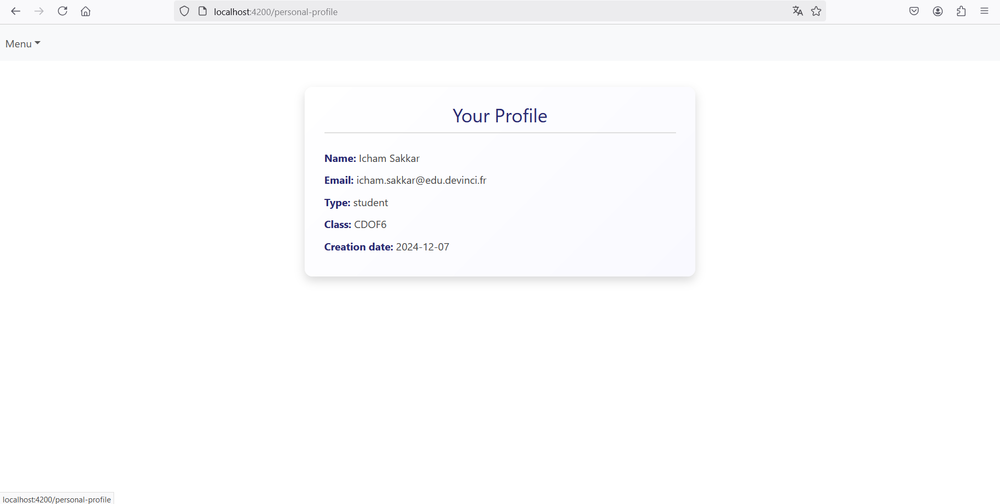
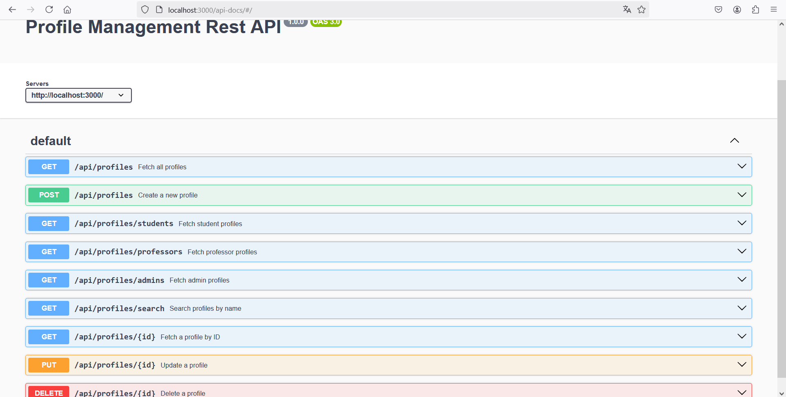

# Profile Management System

## Home page

## Charts page
Various interactive charts

## Display profiles

## Display profiles using AG-Grid

## Create profiles
Enter the name, surname, email, select the profile type and enter the extra attribute (class if student, teaching if professor).

## Lessons

## Personal profile

## Swagger ui Rest API
Url: `http://localhost:3000/api-docs/#/`

## Development server
Run `ng serve` for a dev server. Navigate to `http://localhost:4200/`.

Run `npm run start` for the backend server. Navigate to `http://localhost:3000/api/`.

## PostgreSQL database
A database is required for storing the profiles.

Name of the database: SEprofiles

User: SEDBuser

Password: pass123

You can use the web page to create new profiles, or you can run the SQL script located in the data folder.

## Work done
Icham SAKKAR: backend & connecting it to frontend

Maxim QUÉNEL: frontend pages: view-profile page, view-profile-grid page (using AG-Grid), profile creation

Cyprien MOUTON: frontend pages: home, charts (using Highcharts), lessons

Elouan QUINIOU: swagger ui setup

We couldn't all use GitHub as only one person had access to the database in order to test if they worked.
They created the pages separately and gave them to me, and I added them into the repository.